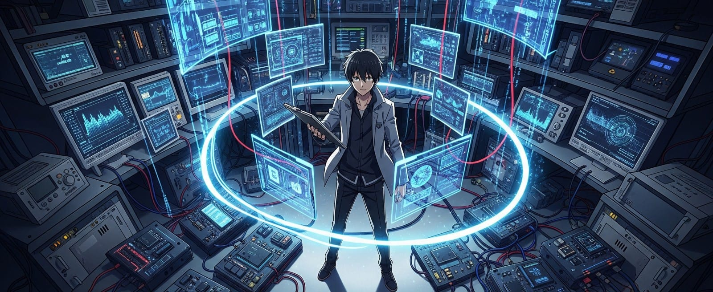

  

##  Namaste Amigo 
Shekhar here, an ECE Undergrad,who actively engages in projects and internships, focusing on ideation, Embedded Systems and RTOS development, IoT and Edge AI with a strong interest in Computer Vision, Image Processing, and Deep Learning.

As my favourite writer, Jules Verne stated

### "Science, my lad, has been built upon many errors; but they are errors which it was good to fall into, for they led to the truth."
His words resonate deeply with my personal endeavor towards continuous learning and exploration with technology.

⚗️I’m a hyper-curious, science-fueled brainiac on a mission to build the heck out of life and make it ridiculously better. Wasting time? Not in this 10 billion percent rational brain(We Binary Bros, if you get the reference). If something sparks my interest, it becomes my next grand experiment — and trust me, I go full throttle, no shortcuts, no compromises.
Tech is my lab coat and beaker, my katana and shield. I take every last skill from the battlefield of industry and weaponize it like a scientific arsenal — deploying it in daily life to engineer brilliance. Innovation isn’t a job. It’s a stone-cold revival mission to reforge the world, one epic idea at a time.

📚Beneath the hype and high-energy hustle, there’s a rational core — shaped by books, long thoughts, and quiet moments of philosophical clarity. I’m not just chasing innovation for the thrill; I’m chasing meaning, depth, and ideas that endure.

### "You have the right to work, but never to the fruit of work. You should never engage in action for the sake of reward, nor should you long for inaction." - Bhagavad Gita 2.47

## Fall, Rise, Fall harder RISE higher 🏔️

##  Languages & Technical Proficiencies

<table>
<tr>
<td>

I am proficient in various programming languages, tools, and technologies:
 
 
**Programming Languages:**  

 

**Embedded Systems & RTOS:**  

 

**AI & Machine Learning:**  

 

**Computer Vision & Signal Processing:**  

 

**Hardware Design & EDA:**  

 

**Development Tools & Methodologies:**  

 

</td>
<td>

</td>
</tr>
</table>

##  Github Statistics

<!--
**ShekharShwetank/ShekharShwetank** is a ✨ _special_ ✨ repository because its `README.md` (this file) appears on your GitHub profile.

Here are some ideas to get you started:

- 🔭 I’m currently working on ...
- 🌱 I’m currently learning ...
- 👯 I’m looking to collaborate on ...
- 🤔 I’m looking for help with ...
- 💬 Ask me about ...
- 📫 How to reach me: ...
- 😄 Pronouns: ...
- ⚡ Fun fact: ...
-->

